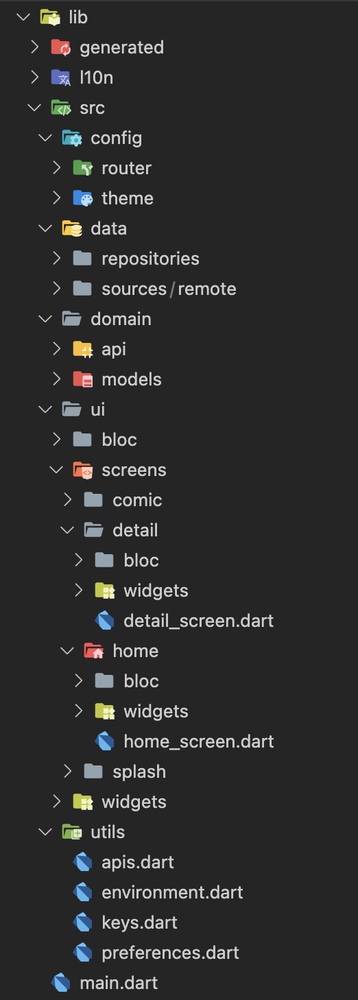
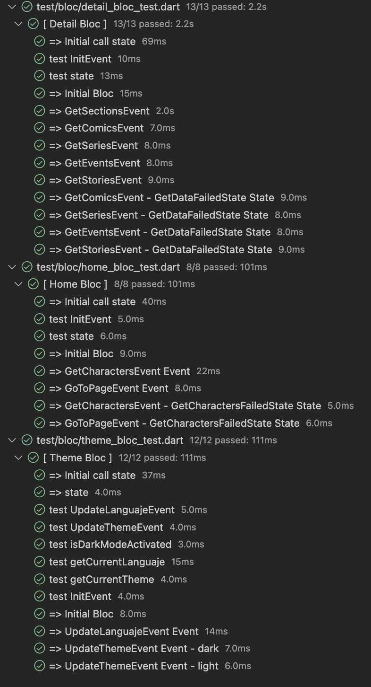
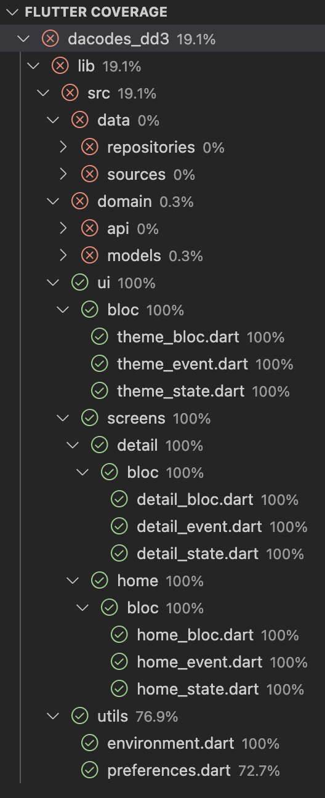
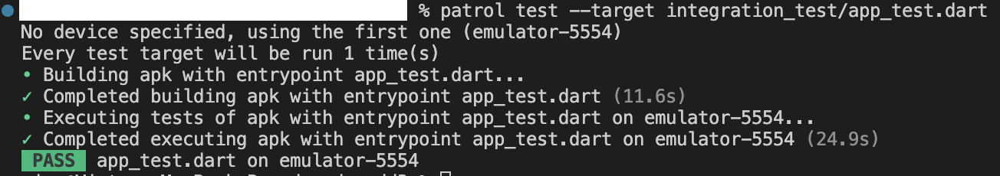

# Prueba técnica para Dacodes-DD3
# Arquitectura:

Este proyecto está realizado con una mezcla de Clean Architecture y BLoC

|Directorio|Descripción|
|----------|-----------|
|/generated|Los genera flutter_localizations para el manejo de idiomas|
|/l10n|Archivos .arb dónde se encuentran las llaves y valores de los textos de la app en diferentes idiomas|
|-|-|
|/src|Es dónde se encuentra todo el código del proyecto|
|-|-|
|/src/config/router|Está toda la configuración de las rutas (navegación) de las pantallas dentro de la app|
|/src/config/theme|Estan todos los archivos necesarios para la configuración de los colores y estilos de texto|
|-|-|
|/src/data/repositories|Se encuentran las declaraciones de los métodos para acceder a la api|
|/src/data/sources|Se encontrarán los métodos con su lógica para obtenr los datos remotos o locales |
|-|-|
|/src/domain/api|Archivos con las clases abstractas para implementar en los sources y a su vez en los repositorios|
|/src/domain/models|Archivos con las clases de todos los modelos usados en los repositorios y dentro de la app|
|-|-|
|/src/ui/|Estarán los archivos referentes a las pantallas y widgets a mostrar en la app|
|/src/ui/bloc|BLoC general de la app|
|/src/ui/widgets|Widgets que son compartidos en diferentes pantallas|
|/src/ui/screens|Pantallas que se muestran en la app, separadas por cada sección o modulo. Cada carpeta tiene su BLoC y sus widgets individuales que sólo se usan en esa pantalla |
|-|-|
|/src/utils|Se encuentran los archivos con constantes que se usan en el proyecto o métodos de ayuda|
|-|-|
|/test|Archivos con los test unitarios de los BLoC's usados en el proyecto|
|/integration_test|Archivos con los test de integración|
|/_screenshots|Archivos de muestra para evidenciar el funcionamiento correcto de la app|

# Test:

Todos los test unitarios de los BLoC funcionando correctamente

Se completó al 100% el coverage de los BLoC's usados en el proyecto

Los test de integraación se realizaron con Patrol para un testeo más optimizado sin tanto código.

Evidencia de que los test de integración se aprobaron con éxito

\* NOTA: Por falta de tiempo sólo se cubrieron los BLoC's dejando pendiente los test unitarios de las apis, repositorios y modelos

----

Video del demo de la app : [enlace](https://github.com/vico-aguado/dacodes-dd3/blob/main/_screenshots/demo.mp4)

Video del test de integración de la app : [enlace](https://github.com/vico-aguado/dacodes-dd3/blob/main/_screenshots/integration_test.mov)

----

### Cualquier duda o comentario estoy a sus órdenes.